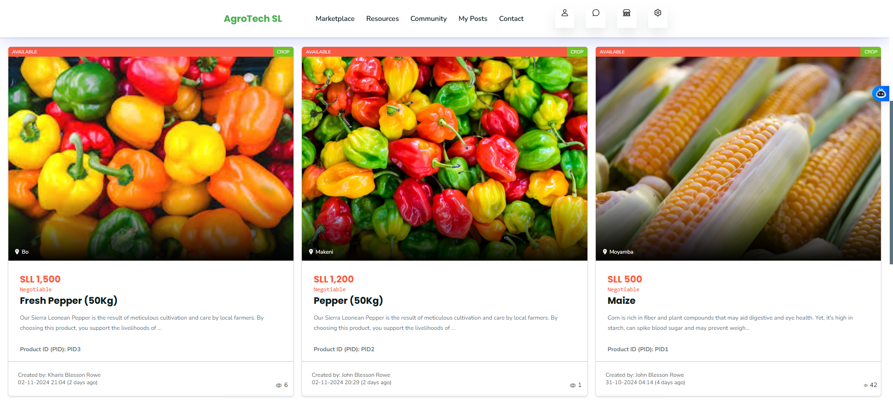
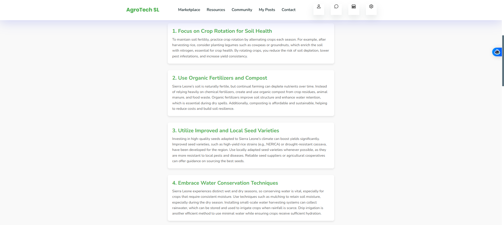

# AgroTech SL: Enhancing Agriculture in Sierra Leone

<a href="https://agrotechsl.onrender.com/">Demo</a>

Overview:
AgroTech SL is a web-based application designed to revolutionize the agricultural landscape in Sierra Leone by connecting farmers, agricultural entrepreneurs, and consumers. The platform aims to improve agricultural productivity, facilitate knowledge sharing, and promote e-commerce in the agricultural sector.

# Key Features:

## 1. E-Commerce Marketplace:
   - Product Listings: Farmers can create profiles to showcase their products, including fresh produce, seeds, and agricultural tools. Each listing will include descriptions, prices, and availability.
   - Order Placement: Consumers can browse the platform, place orders for products, and make payments online, ensuring a seamless purchasing experience.

   

## 2. Knowledge Hub:
   - Learning Resources: The platform will host a library of training materials, including articles, videos, and tutorials on best farming practices, pest control, crop management, and sustainable agriculture.
   - Webinars and Workshops: Regular online sessions with agricultural experts will be organized to provide farmers with up-to-date knowledge and skills.

   

## 3. Community Engagement:
   - Forums and Discussions: A dedicated space for farmers to ask questions, share experiences, and discuss challenges and solutions with their peers.
   - Networking Opportunities: Facilitation of connections between farmers, suppliers, and potential investors to encourage collaboration and investment in agriculture.

   

## 4. Market Insights:
   - Price Trends: Access to real-time data on market prices for various agricultural products, helping farmers make informed decisions about what to grow and when to sell.
   - Demand Forecasting: Tools to analyze consumer trends and preferences, allowing farmers to tailor their production to meet market needs.

   

## 5. Ask-AI:
Interactive Chat for Agricultural Queries
The platform includes an Ask-AI feature powered by an AI chatbot that provides real-time answers to agricultural questions.

   

## Key Benefits:
- Farmers and users can ask questions related to farming, crop management, pest control, and more.
- Personalized advice on best practices for enhancing productivity.
- 24/7 availability ensures users always have access to information.

This tool bridges knowledge gaps and empowers users with instant, reliable insights to make better farming decisions.

## 6. Support Services:
   - Advisory Services: Access to agricultural experts for personalized advice on crop selection, pest management, and farm optimization.

## Impact:
AgroTech SL aims to empower farmers in Sierra Leone by providing them with the tools and knowledge they need to enhance productivity and profitability. By bridging the gap between producers and consumers, the platform fosters a vibrant agricultural community, encourages investment in the sector, and ultimately contributes to food security and economic growth in the region.

## Conclusion:
Through AgroTech SL, we envision a future where farmers in Sierra Leone are not only more productive but also more connected and informed. By harnessing the power of technology, we can transform the agricultural landscape and support the livelihoods of countless individuals in the country.

## How To Run This Application Locally

Prerequisites

Make sure you have the following installed:

	•	Node.js: Download and install Node.js
	•	npm (Node Package Manager): Comes with Node.js
	•	MongoDB or any other database if required

Getting Started

1. Clone the Repository

git clone https://github.com/Johnblesson/AgroTech.git
cd AgroTech

2. Install Dependencies

npm install

3. Configure Environment Variables

Create a .env file in the root directory and add the following lines. These are sample values; replace them with your actual configuration values.

## Server Configuration
PORT=5000

## Database Configuration
- DATABSE_URL=mongodb://0.0.0.0:27017/AgroTechSl

## API Keys
- SESSION_SECRET=your-secret-key

## Authentication
- JWT_SECRET=your-jwt-secret

## AWS S3 Configuration
- AWS_SECRET_ACCESS_KEY=your-aws-secret-access-key
- AWS_ACCESS_KEY_ID=your-aws-access-key-id
- AWS_REGION=your-aws-region
- AWS_S3_BUCKET_NAME=agrotech-sl

## Geolocation Configuration
- GEOLOCATION_API_URL=http://api.ipapi.com
- API_KEY=your-api-key

## OpenAI configuration
- OPENAI_API_KEY=your-api-key

## Weather API Key
WEATHER_API_KEY=your_weather_api_key
WEATHER_API_URL=https://api.openweathermap.org

4. Run the Application

Development Mode

npm run dev

Production Mode

npm start

The application should now be running on http://localhost:5000.

5. Accessing the Application

Once the server is running, open your web browser and go to http://localhost:5000 to access the application.
